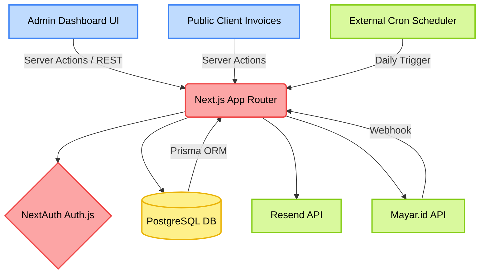
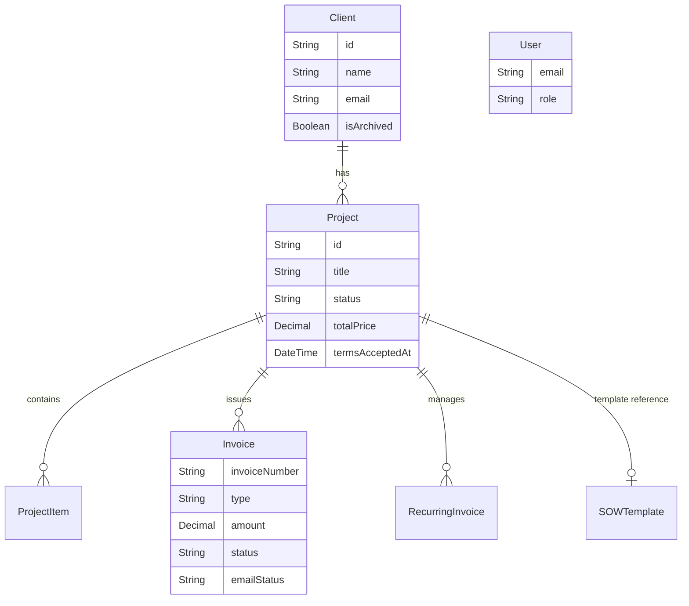

## Architecture Spec: ProjectBill Core System

### System Overview
ProjectBill is a self-hosted B2B invoicing and project tracking application. The system follows a monolithic architecture built completely on the Next.js framework (App Router) to simplify deployment and integrate full-stack logic tightly. The backend relies on Next.js Server Actions and API routes, directly connected to a PostgreSQL database via Prisma ORM. Core external integrations include Mayar.id for payment processing (via async webhooks) and Resend for transactional emails.

### Component Architecture Diagram


### Stack & Technologies
- **Frontend**: Next.js 15+ (React), Tailwind CSS, Shadcn UI
- **Backend**: Next.js 15+ (App Router API & Server Actions)
- **Database**: PostgreSQL (Containerized via Docker) with Prisma ORM v7
- **Authentication**: Auth.js (NextAuth v5)
- **Emails**: React Email + Resend API
- **Payments**: Mayar.id Headless API 

### Database Schema (Core ERD)

**Key Sub-Models & Tables:**
- **`SOWTemplate`**: Reusable markdown agreements for projects.
- **`Settings`**: Global singleton (`id: "global"`) for company data and encrypted API keys.
- **`AuditLog`**: Compliance tracking for sensitive field updates.
- **`RecurringInvoice`**: Tracks cron jobs for periodic invoice duplication.

### API & External Communications
- **Webhook Handlers**: `POST /api/webhook/mayar` (Secured via HMAC SHA256 signature verification).
- **Cron Endpoints**: `POST /api/cron/recurring-invoices` (Secured via Bearer `CRON_SECRET`).
- **Internal APIs**: Guarded by NextAuth sessions and strict `user.role === "admin"` checks where necessary.

### Project Structure Conventions
The codebase follows standard Next.js App Router patterns, strictly separating authenticated and public scopes:
```text
src/
├── app/
│   ├── (dashboard)/   # Guarded admin views (Clients, Projects, Settings)
│   ├── (public)/      # Client-facing static/dynamic views (e.g., /invoices/[id])
│   ├── api/           # Backend REST endpoints, Cron Jobs, Webhook receivers
├── components/        # UI building blocks (Shadcn UI, Radix primitives, custom widgets)
├── emails/            # React Email templates (.tsx) compiled to HTML via Resend
└── lib/               # Utility libraries (Crypto, Auth, Prisma Client, Math)
prisma/                # Database schema, migrations, and seed scripts
```

### Deployment Architecture
- **Web Tier**: Designed to run optimally on **Vercel** or standard Node.js server environments (e.g., Docker `node:alpine`).
- **Database/Storage**: Uses **PostgreSQL** (can be hosted on Supabase, Neon, or self-hosted via `docker-compose.yml`).
- **Backup**: Ships with a ready-to-use Docker sidecar (`prodrigestivill/postgres-backup-local`) to automate daily cron `.sql.gz` backups.

### Security & Scaling Notes
- **API Key Storage**: Sensitive keys (Resend, Mayar) are symmetrically encrypted at rest (AES-256-GCM) via a custom `crypto.ts` module.
- **XSS Prevention**: Markdown rendering (Terms, projects) uses `rehype-sanitize` to strip script tags.
- **Rate Limiting**: Custom IP-based rate limiting on Cron/Webhook endpoints.
- **Cache Strategy**: Heavy utilisation of Next.js declarative caching (`revalidatePath()`) allowing efficient real-time polling sync with webhooks without crushing DB performance.
- **Idempotency**: Webhook parsing and Cron runner use strict DB state gating (`status === "unpaid"`) combined with `prisma.$transaction()` to avoid race conditions.
